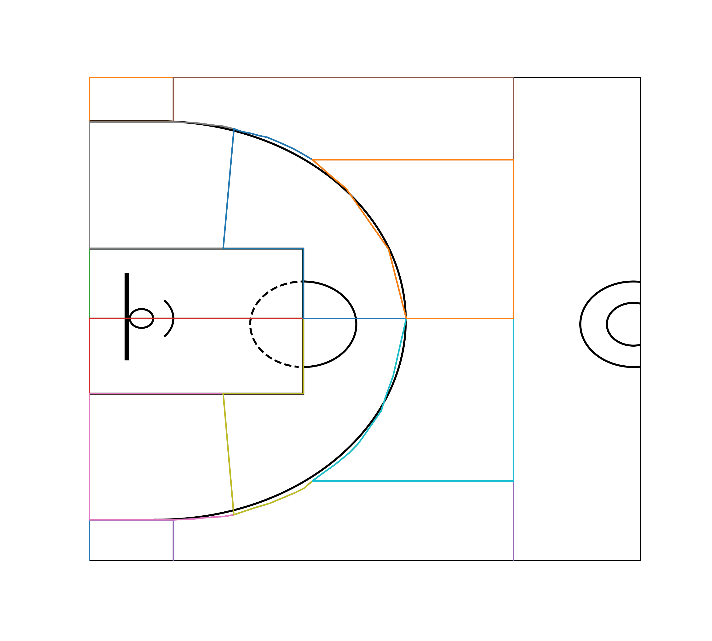

# How does geography affect to individual scorers in Spanish Basketball League?

The old game of basketball has changed in the last decade. Now, it has converted in a spatial game where you have to find the best places to take a shot without opposition but with the best efficiency. Rest in peace mid-range pull-ups. Rest in peace low post plays. 

Nowadays, NBA has publicly a lot of up to-date statistics about the performance of each player in the league. Unfortunately, these kind of stats has not arrived in European Basketball yet. But, at least, we can understand some trends about the preferred shooting zones in Liga Endesa (Spanish Basketball League)

How? Dividing the half-court in 12 (yes, 12) different zones to get the number of shots attempted from every player from each zone. Afterwards, we have clustered players from 2020/21 season based on their average stats per game and their percentage of field goals made depending on the zones-court.

## Use Streamlit to see the results!
We have shown the results of the cluster and the individual stats of each player on Streamlit. 
You can access them easily, cloning this repo and executing in your shell: `streamlit run main.py`

### Main libraries used on the project
- [Selenium](https://pypi.org/project/beautifulsoup4/)
- [Matplotlib](https://matplotlib.org/)
- [Scikit-Learn (K-Means)](https://scikit-learn.org/stable/modules/generated/sklearn.cluster.KMeans.html)
- [Pandas](https://pandas.pydata.org/docs/)
- [Streamlit](https://docs.streamlit.io/en/stable/)
- [Shapefile](https://pypi.org/project/pyshp/)

If you want to use the same libraries, you can use the `requirements.txt` file. 

### How did we get the data?
All the info have been collected scraping websites such as RealGM and Jornada Virtual ACB, the play-by-play info of every game from the Spanish League. Inside this repo, you will see deeply more about this topic.

At the end of the day we have collected info of more than 35.000 shots made during this season 2020/21.

## Process the data and analyzing it.
In order to get value info from these shots, we have created polygons to insert them into a plotted court. You can see them at the beginning of this file. 

Then, using K-Means we have clustered players and we have found that there are four types of players with our data of more than 40 features:

-**Elite-Scorers**: Best players in their teams, get a lot of points with good percentages. 
-**Big-Guys**: Usually centers or power-forwards who have an important impact in their teams. 
-**Playmakers**: Guards and shooting-guards who can shoot from every zone of the court.
-**Role-Players**: The middle-class of the league. They assume less shots and are specialized in defensive tasks. 

